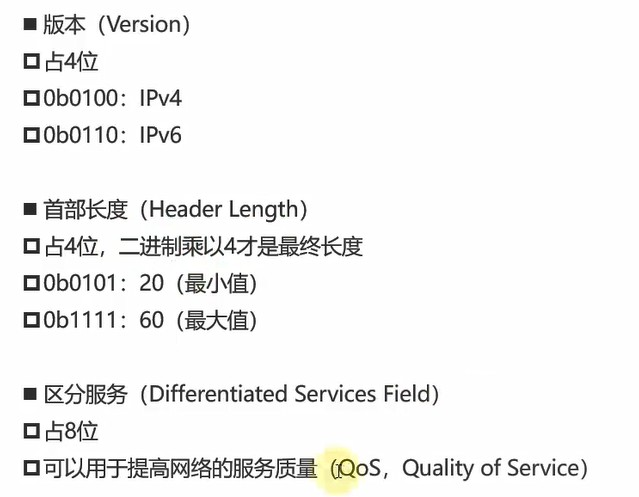

### ARP

发广播的目的：获取对方的mac地址：
例如：192.168.1.20想向192.168.1.21发数据，它先广播：192.168.1.21的mac地址是多少，当192.168.1.21收到广播发现在问自己，就会将自己的mac地址返回给192.168.1.20,这样192.168.1.20就有了目标的mac地址。在广播过程中，目标mac开始是FFFF.FFFF.FFFF，表示 谁都同网段谁都可以收到。只有通过arp协议获取到目标mac，再次发包，目标mac就换成了获取到的mac. ARP协议会缓存mac地址，第一次获取到后，第二次发送就会直接发送。

广播在同一网段中传播，不同网段中不能广播. 

半双工通信：同一时间只能有一方发送消息通信，比如A,B之前通过同轴电缆连接起来了，当A给B发消息时，B不能给A发消息。

集线器发送包也是广播，所有相连的设备都会发送消息，只有目标会回复。

网桥能通过自学习得知每个接口那侧的mac地址

### MAC地址
六字节（49bit)的 media access control address 
mac地址查询：https://mac.bmcx.com/
```
40-55-82         0A-8C-6D   
组织唯一标识      网络接口标识符
```

### ip地址
ip有两部分组成：网络标识，主机标识
同一网段，网络标识（网络ID相同）
网段的计算方法： 子网掩码 & ip地址
示例：
```
ip:192.168.1.10
subnet:255.255.255.0

1100 0000 1010 1000 0000 0001 0000 1010
1111 1111 1111 1111 1111 1111 0000 0000

1100 0000 1010 1000 0000 0001 0000 0000
192.168.1.0
```

### 物理层


网络分层


分层的意思是，例如网络层发送icmp，它其实是没有上面的应用层，运输层的数据的，它本身只有icmp的数据

### 数据链路层


不同类型的数据链路，使用的协议不同是针对这里说的的数据链路层，比如，数据链路层中的广播信道 使用CSMA协议。

为了检测发送的帧是否产生了冲突，以太网帧最少要64byte


当数据帧从A发送到b,如果a没有发完，而b却开始返回数据了，两者在中间相遇，a的数据会被弹回，当返回到a时，发现a仍在发，此时就知道返回的数据是冲突数据，否则无法知道是否是冲突。这样看至少是两倍的a,b之间的包长度（不知如何表述），64字节


数据链路层将数据封装成贝帧：


数据链路层---透明传输
透明传输是为了解决字节冲突的问题：帧的结束或者开始也是一个字节标志，当ip数据包中有相同字节时，如果不作处理，就会被错误识别为帧的开始或者结束。


透明传输的原理图：当数据中出现了特殊字符，在链路中会加上ESC，到达目标结点又会将ESC去掉，从而避免数据解析错误的问题。 这里需要注意的是，仅仅是将原始数据中的特殊字符进行处理，而帧开始和结尾的并不处理。


差错校验：


这里的差错校验，我的理解是类型于文件的Md5值校验，FCS是根据帧的数据部分+首部进行计算得出的，当内容发生变化计算的结果也会变化，从而与传输的FCS发生变化，说明
数据出错了，可能是解析出错，也可能是别的原因。那么两者不一致，网卡会将数据丢掉。而如果两者FCS一致，网卡会将FCS丢掉，所以抓包是抓不到FCS的。


以太网v2帧结构


ppp


ppp协议数据部分与数据链路层的数据部分一样，不能超过1500byte, mtu

网卡


### 网络层

网络层包结构


对应的字段:



首部的分为两部分，固定部分共5x4bytes 共20字节。需要注意的是，首部中：首部长度为二进制表示：0101 即5 。 5x4区20字节

标识，标志


偏移量，分包因为过大被分片时，第一片的偏移量为0，随后第二片的偏移量为片长度与序号-1的乘积。

ttl:


ttl的存在是为了解决循环路由的问题，当路由a的默认路由是b,b的默认路由是a,而要发送的数据包a,b路由都不知道下一跳是哪时，a会走默认路由，到b ,
b发现也不知道下一跳，走默认路由a，如此a,b在踢皮球，导致资源占用和浪费，而有ttl的存在，在踢了一定次数后，这个包会被丢掉，并返回错误信息。

可以通过tracert, pathing等命令工具，查看通过的每个路由

### 传输层
传输层的协议主要有两个：


udp:

这里的udp长度指的是首部和数据一起的长度，而不仅仅是首部的长度

检验和


伪首部只用于计算，而并不真实存在。

端口


tcp数据结构：


UDP的首部中有个16位的字段记录了整个UDP报文段的长度（首部+数据）
但是，TCP的首部中仅仅有个4位的字段记录了TCP报文段的首部长度，并没有字段记录TCP报文段的数据长度

UDP首部中占16位的长度字段是冗余的，纯粹是为了保证首部是32bit对齐
TCP\UDP的数据长度，完全可以由IP数据包的首部推测出来：
传输层的数据长度 = 网络层的总长度 – 网络层的首部长度 – 传输层的首部长度

检验和：和udp一样，tcp中检验和也是计算：伪首部 + 首部 +数据
伪首部：占用12字节，仅在计算检验和时起作用，并不会传递给网络层

标志位：
URG（Urgent）
当URG=1时，紧急指针字段才有效。表明当前报文段中有紧急数据，应优先尽快传送

ACK（Acknowledgment）
当ACK=1时，确认号字段才有效

PSH（Push）
RST（Reset）
当RST=1时，表明连接中出现严重差错，必须释放连接，然后再重新建立连接

SYN（Synchronization）
当SYN=1、ACK=0时，表明这是一个建立连接的请求
若对方同意建立连接，则回复SYN=1、ACK=1

FIN（Finish）
当FIN=1时，表明数据已经发送完毕，要求释放连接

序号（Sequence Number
占4字节
首先，在传输过程的每一个字节都会有一个编号
在建立连接后，序号代表：这一次传给对方的TCP数据部分的第一个字节的编号

确认号（Acknowledgment Number）
占4字节
在建立连接后，确认号代表：期望对方下一次传过来的TCP数据部分的第一个字节的编号

窗口（Window）
占2字节
这个字段有流量控制功能，用以告知对方下一次允许发送的数据大小（字节为单位）


**tcp的几个特点**
- 可靠传输: 停止等待ARQ协议
> 当等待了一段时间仍没有收到对方的收到确认信息，就自动重新发送一次。虽然接收方会收到两份一样的数据，接收方会自动将重复数据丢掉。如果因为传输过程时间比较长，导致同一包被发了两次，且第一次发的后确认，它将被丢弃。这种情况效率比较低。

若有个包重传了N次还是失败，会一直持续重传到成功为止么？
这个取决于系统的设置，比如有些系统，重传5次还未成功就会发送reset报文（RST）断开TCP连接

- 连接ARQ协议，滑动窗口协议

> 连续ARQ指的是一次发送多个包，比如m1,m2,m3,m4一次性发过去，当接收方收到后只返回m4的确认，收到m4确认之后即表示 m1,m2m3,m4都收到了，此时便从M5开发改送。

窗口表示我还有多少缓存空间可以用来接收数据，接收方会告诉发送方我的窗口为100bytes，那么发送方最多只能发送100bytes.

**sack 选择性确认**
> 当一次性发送多个包时，其中一个由于某种原因，发送失败，如果没有选择性确认，那么这个失败的包及它之后 的包都必须重传，这要效率低。因此，才有了选择性确认。


当有1000个字节，如上图所示，传输过程中，部分包传输失败，sack会发送的是边界信息：201，301-400等，由此可以推断出201-300传输失败了。

**为什么在传输层就进行包切割**
在传输层的包，是整个包一旦失败就得重传整个包，其它层没有重传机制。在传输层分割后，如果失败只需要重传这一个包就行，如果没分割，就得将所有的一个大包重传


**流量控制**
主要指缓存的大小，通过窗口字段来传递。 

流量控制指的是：让发送方的速度不要太快，让接收方来不及处理

主要通过*确认*报文中窗口字段来控制，发送方的发送窗口大小不能超过接收方给出的窗口大小。当发送方收到接收窗口的大小为0，发送方会停止发送。

如果接收方一开始发送0窗口，后面接收方又有了一些存储空间，给发送方改善的非0窗口的报文丢失了，发送方的发送窗口一直为零，双方陷入僵局：
解决办法：
> 当发送方收到0窗口时，发送方停止发送报文，但同时开启一个定时器，隔一段时间就发个测试报文去询问接收方最新的窗口大小。如果接收的窗口大小仍是0，则发送方刷新启动定时器。

**拥塞控制**
防止过多数据注入到网络中，避免网络中的路由器或者链路过载

*慢开始（slow start）*：
开始将mss 设置比较小，拥塞窗口也比较小，即开始试探性发送。
cwnd初始值比较小，然后随着数据包被接收方确认（收到一个ack）,随后 cwnd就成倍增长。（指数增长）

*拥塞避免*
ssthresh(slow start threshold) 慢开始阈值，cwnd达到阈值后，以线性方式增加
拥塞避免（加法增大）：拥塞窗口缓慢增大，以防止网络过早出现 拥塞
乘法减小： 只要出现 拥塞，把ssthresh减半，与此同时，执行慢开始算法（cwnd又恢复到初始值)

*快速重传*
接收方每收到一个失序的分组后就立即发出重复确认，使发送方及时知道有分组没有到达 ，而不要等待自己发送数据时才进行确认。
发送方：只要连续接收三个重复确认（总共四个相同的确认），就应当立即重传对方尚未收到的报文段，而不必继续等待重传计时器到期再重传。

*快速恢复*
当发送方连续收到三个重复确认，就执行乘法减小算法，把ssthresh减半，与慢开始不同的是，不执行慢开始算法，即cwnd不恢复到初始值，而是在减半后的数值，并开始执行拥塞避免算法（加法增大），使拥塞窗口慢慢线性增大


MSS(Max segment size): 每个段最大的数据部分大小

cwnd(congestion window) 拥塞窗口

rwnd(receive window) 接收窗口

swnd(send window) 发送窗口

swnd = min(cwnd,rwnd)

####三次握手
tcp建立链接：


**为什么是三次，两次不行么？**
如果两次连接就可以建议连接，考虑下面的情况：
当client第一次发送连接请求，因为网延迟，server端没收到，此时client会再次尝试发送握手请求，假如server此次正常收到请求,并返回ACK确认，那么由于两次建立连接的机制，此时连接成功，然后进行通信。在随后的某个时刻，之前因网络原因发送的第一个请求到达，此时server端处于监听状态，收到此请求会认识client端再次建立连接的请求，会给client端返回ACK确认。但client端所需要的请求在第二次请求时已经建立，并完成了通信。也即client端认为这不是他要的请求，因为他要的请求已经完成。所以对此确认信息不与理睬，两次握手即建议连接的机会，在此情况下会让server端认为新的连接已经建立，会一直等待client端发送新的报文，导致server端资源浪费。


**第三次握手失败会发生什么**
会多次发送ACK请求，如果一直收不到应答，将发送RST,断开连接。
